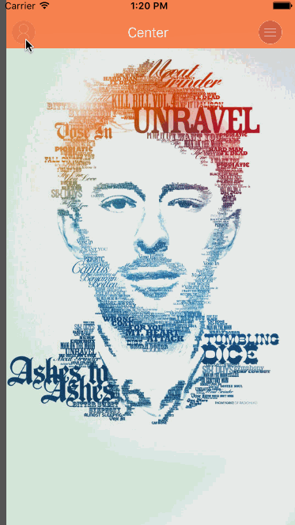

# TYZSideMenu
---

带毛玻璃特效的侧边栏View

### 如何安装

* 使用cocoapods

`
pod "TYZSideMenu"
`

* 将TYZSideMenu拖入工程

### 如何使用

* 添加头文件

`
	#import "TYZSideMenuHeader.h"
`

* 实例化

`
TYZSideMenu *view = [[TYZSideMenu alloc] initWithContentViewController:[[CenterViewController alloc]init] leftSideViewController:[[LeftViewController alloc]init] rightSideViewController:[[RightViewController alloc]init]];
`

如果只需要显示一侧的SideMenu 只需要传入需要一侧的ViewController即可

